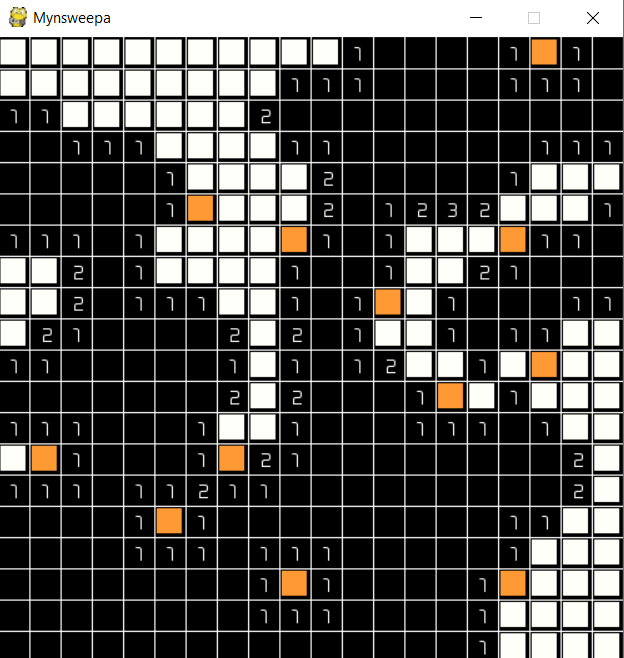

## Mynsweepa

### Play the game at one of these links:

- [Repl.it](https://repl.it/@akylus/mynsweepa)
- [Website](https://myn-working--akylus.repl.co/)

The Classic and nostalgic minesweeper has been made from scratch!




How to play?
```
Use logical deductions to find all the mines.

Just click on a square to reveal a box or hit right-click to flag a mine.

Number of mines: 40
Grid size: 20x20
```
